# Animal Identifier - Architecture Guide

> Full technical walkthrough of how the app works, based on the source code.

---

## Table of Contents

- [Project Structure](#project-structure)
- [Tech Stack](#tech-stack)
- [SvelteKit Routing](#sveltekit-routing)
- [Authentication Flow](#authentication-flow)
- [Database Schema](#database-schema)
- [API Endpoints](#api-endpoints)
- [Sightings Store (Offline-First)](#sightings-store-offline-first)
- [IndexedDB Service](#indexeddb-service)
- [Service Worker (PWA)](#service-worker-pwa)
- [Sighting Form & Image Compression](#sighting-form--image-compression)
- [Utilities](#utilities)
- [Testing](#testing)
- [Deployment](#deployment)

---

## Project Structure

```
src/
├── routes/                    # Pages & API endpoints
│   ├── +layout.svelte         # App shell (header, auth guard, SW registration)
│   ├── +layout.ts             # Universal load — fetches user (works offline)
│   ├── +page.svelte           # Home page
│   ├── +page.server.ts        # Root redirect logic
│   ├── login/+page.svelte     # Login form
│   ├── signup/+page.svelte    # Signup form
│   ├── logout/+page.svelte    # Logout confirmation
│   ├── dashboard/
│   │   ├── +page.svelte       # Protected sightings list
│   │   └── +page.server.ts    # Server-side data for dashboard
│   ├── sighting/
│   │   ├── +page.svelte       # Create sighting page
│   │   └── [id]/
│   │       ├── +page.svelte   # Sighting detail page
│   │       └── edit/
│   │           └── +page.svelte # Edit sighting page
│   └── api/
│       ├── auth/
│       │   ├── login/+server.ts
│       │   ├── signup/+server.ts
│       │   ├── logout/+server.ts
│       │   └── me/+server.ts
│       └── sightings/
│           ├── +server.ts           # GET list + POST create
│           └── [id]/
│               ├── +server.ts       # GET / PUT / DELETE sighting
│               └── image/+server.ts # GET / POST / DELETE image
├── lib/
│   ├── components/
│   │   ├── Header.svelte        # Nav bar with user menu + sync indicator
│   │   ├── SightingCard.svelte  # Card component for dashboard list
│   │   ├── SightingForm.svelte  # Reusable create/edit form
│   │   └── SyncStatus.svelte    # Online/offline status badge
│   ├── stores/
│   │   ├── auth.ts              # Auth state (localStorage)
│   │   └── sightings.ts         # Sightings state (IndexedDB + sync engine)
│   ├── services/
│   │   ├── sightings.ts         # API client for sightings
│   │   └── idb.ts               # IndexedDB wrapper
│   ├── db/
│   │   ├── schema.ts            # Drizzle ORM table definitions
│   │   └── client.ts            # PostgreSQL connection
│   ├── server/
│   │   └── auth.ts              # Session creation/validation
│   └── utils/
│       ├── constants.ts         # Routes, validation rules, config
│       ├── validation.ts        # Input validators
│       ├── timestamp.ts         # Date helpers
│       ├── gps.ts               # Browser geolocation wrapper
│       └── image-compression.ts # Client-side image resize + compress
├── service-worker.ts            # SvelteKit-integrated PWA service worker
├── hooks.server.ts              # Auth middleware (runs every request)
└── app.d.ts                     # Global TypeScript types

e2e/
├── auth-sightings.spec.ts       # Auth + CRUD E2E tests
├── offline.spec.ts              # Offline PWA behavior tests
└── global-setup.ts              # Docker/DB setup for E2E

docker-compose.prod.yml          # Production Docker stack
Dockerfile                       # Multi-stage Node build
docker-entrypoint.sh             # Schema push + app start
.github/workflows/
├── ci.yml                       # CI: test, typecheck, build, E2E
└── deploy-proxmox.yml           # Self-hosted Proxmox deployment
```

---

## Tech Stack

| Layer        | Technology                                  |
| ------------ | ------------------------------------------- |
| Framework    | SvelteKit 2 + Svelte 5 (runes)              |
| Language     | TypeScript                                   |
| Database     | PostgreSQL 16                                |
| ORM          | Drizzle ORM                                  |
| Auth         | httpOnly cookies + bcrypt                    |
| Offline      | IndexedDB + localStorage + Service Worker    |
| PWA          | Web App Manifest + SvelteKit Service Worker  |
| Testing      | Vitest (unit) + Playwright (E2E)             |
| Build        | Vite                                         |
| Deployment   | Render (adapter-auto) + Proxmox (adapter-node + Docker) |

### Dual Adapter Configuration

The app supports two deployment targets via `svelte.config.js`:

```javascript
import adapterAuto from '@sveltejs/adapter-auto';
import adapterNode from '@sveltejs/adapter-node';

const useNode = process.env.ADAPTER === 'node';

const config = {
    kit: {
        adapter: useNode ? adapterNode({ out: 'build' }) : adapterAuto()
    }
};
```

- **`adapter-auto`** (default) — Used for Render / Vercel / cloud platforms
- **`adapter-node`** — Used for Docker / Proxmox self-hosted deployment (set `ADAPTER=node`)

---

## SvelteKit Routing

SvelteKit uses **file-based routing**. The file name determines what it does:

| File                   | Purpose                                    |
| ---------------------- | ------------------------------------------ |
| `+page.svelte`         | The visible page (HTML + JS)               |
| `+page.server.ts`      | Server-side load function for that page    |
| `+layout.svelte`       | Wraps all child pages (shared UI)          |
| `+layout.ts`           | Universal load function (runs client + server) |
| `+server.ts`           | API endpoint (GET, POST, PUT, DELETE)      |

Folder names become URL segments. `[id]` is a dynamic parameter:

```
src/routes/api/sightings/[id]/+server.ts  →  GET /api/sightings/abc-123
```

### Route Protection

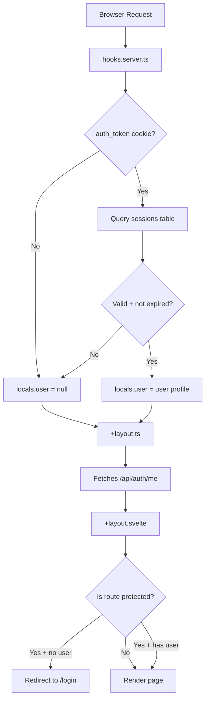

**Public routes** are defined in `+layout.svelte`:

```typescript
const publicRoutes = ['/', '/login', '/signup'];
```

Any route not in that list requires authentication.

> **Note:** The layout uses `+layout.ts` (universal load), not `+layout.server.ts`. This is critical for offline support — universal loads can run client-side without needing a server round-trip for `__data.json`.

---

## Authentication Flow

### How Sessions Work

The app uses **httpOnly cookies** — the browser sends the cookie automatically, but JavaScript can never read it. This prevents XSS attacks from stealing tokens.

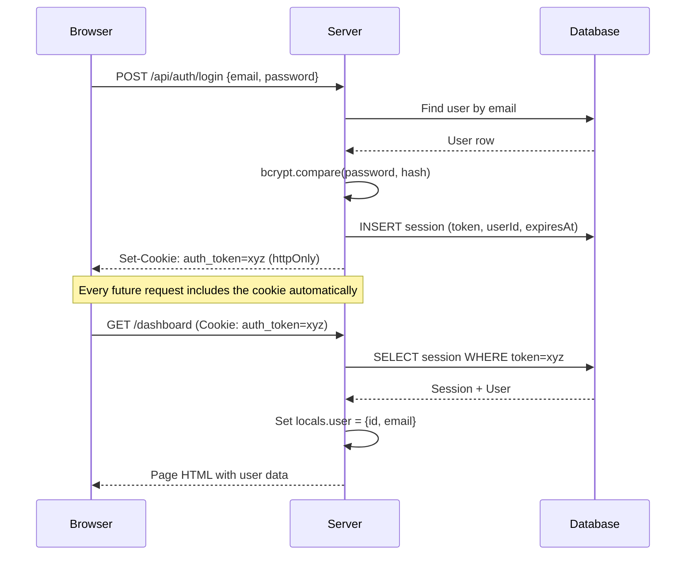

### Key Auth Functions

**`src/hooks.server.ts`** — Runs on every single request:

```typescript
export const handle: Handle = async ({ event, resolve }) => {
    const token = event.cookies.get(SESSION.COOKIE_NAME);
    if (token) {
        // Query DB: join sessions + users, check expiration
        const result = await db.select(...)
            .from(sessions)
            .innerJoin(users, eq(sessions.userId, users.id))
            .where(and(
                eq(sessions.token, token),
                gt(sessions.expiresAt, new Date())
            ))
            .limit(1);
        if (result.length > 0) {
            event.locals.user = { id, email };
            event.locals.token = token;
        }
    }
    return resolve(event);
};
```

**`src/lib/server/auth.ts`** — Creates sessions:

```typescript
export async function createSession(userId: string) {
    const token = crypto.randomUUID();
    const expiresAt = new Date();
    expiresAt.setDate(expiresAt.getDate() + SESSION.DURATION_DAYS); // 30 days

    const [session] = await db.insert(sessions)
        .values({ userId, token, expiresAt })
        .returning();
    return session;
}
```

### Auth Store (Client-Side)

`src/lib/stores/auth.ts` mirrors the server session into localStorage so the UI can react:

```typescript
// After login succeeds:
auth.hydrate();        // Fetches GET /api/auth/me → stores user
await invalidateAll(); // Re-runs all SvelteKit load functions
goto('/dashboard');
```

### Offline Auth Handling

The layout skips `auth.restore` when offline to avoid failing API calls:

```typescript
$effect(() => {
    const isOffline = browser && !navigator.onLine;
    if (!isOffline) {
        auth.restore(data.user ?? null);
    }
    if (browser && isProtectedRoute($page.url.pathname) && !$auth.isAuthenticated) {
        goto('/login');
    }
});
```

---

## Database Schema

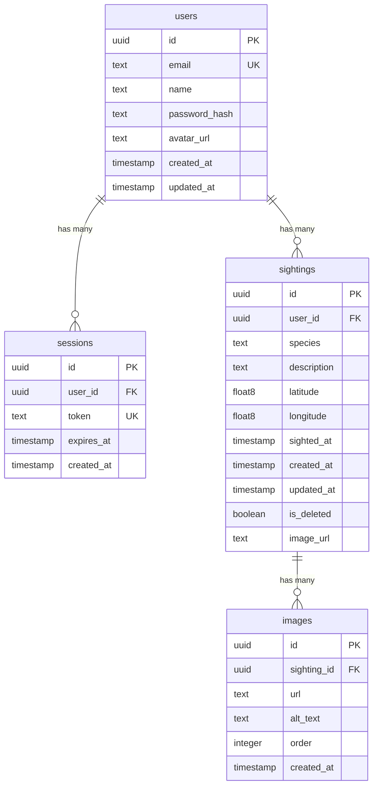

Defined in `src/lib/db/schema.ts` using Drizzle ORM:

```typescript
export const sightings = pgTable('sightings', {
    id: uuid('id').primaryKey().defaultRandom(),
    userId: uuid('user_id').notNull().references(() => users.id, { onDelete: 'cascade' }),
    species: text('species').notNull(),
    description: text('description'),
    latitude: doublePrecision('latitude'),
    longitude: doublePrecision('longitude'),
    sightedAt: timestamp('sighted_at', { withTimezone: true }).notNull().defaultNow(),
    createdAt: timestamp('created_at', { withTimezone: true }).notNull().defaultNow(),
    updatedAt: timestamp('updated_at', { withTimezone: true }).notNull().defaultNow(),
    isDeleted: boolean('is_deleted').notNull().default(false),
    imageUrl: text('image_url')
});
```

> `onDelete: 'cascade'` means deleting a user automatically deletes all their sightings, and deleting a sighting deletes all its images.

> `isDeleted` is a soft-delete flag — the DELETE endpoint sets it to `true` rather than removing the row. All GET queries filter `isDeleted = false`.

---

## API Endpoints

### Auth

| Method | Path                | What it does                    |
| ------ | ------------------- | ------------------------------- |
| POST   | `/api/auth/signup`  | Register new user               |
| POST   | `/api/auth/login`   | Authenticate, get session       |
| POST   | `/api/auth/logout`  | Destroy session, clear cookie   |
| GET    | `/api/auth/me`      | Return current user from cookie |

### Sightings

| Method | Path                            | What it does                       |
| ------ | ------------------------------- | ---------------------------------- |
| GET    | `/api/sightings`                | List sightings (paginated)         |
| POST   | `/api/sightings`                | Create sighting (+ images)         |
| GET    | `/api/sightings/[id]`           | Get one sighting by ID             |
| PUT    | `/api/sightings/[id]`           | Update sighting fields + images    |
| DELETE | `/api/sightings/[id]`           | Soft-delete sighting               |
| GET    | `/api/sightings/[id]/image`     | Get image data for sighting        |
| POST   | `/api/sightings/[id]/image`     | Upload image to sighting           |
| DELETE | `/api/sightings/[id]/image`     | Delete image from sighting         |

### POST `/api/sightings` — Create Sighting

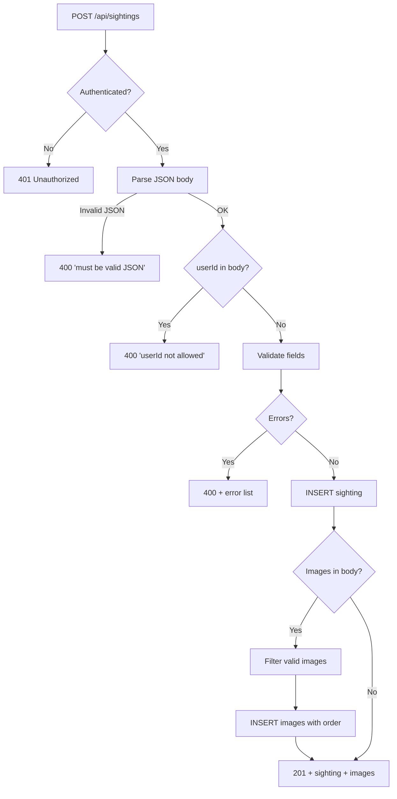

### PUT `/api/sightings/[id]` — Update Sighting

The PUT endpoint validates and rejects non-updatable fields:

```
Rejected fields: id, userId, user_id, createdAt, created_at, isDeleted, is_deleted
```

It also handles image sync — if `images` is in the request body:
1. Deletes all existing images for the sighting
2. Inserts new images from the array (supports `string` URLs and `{url: string}` objects)
3. Updates `imageUrl` on the sighting row to match the first image

**Validation rules** (from `constants.ts`):

| Field       | Rule                                   |
| ----------- | -------------------------------------- |
| `species`   | Required, non-empty string, max 255    |
| `latitude`  | Number, -90 to 90                      |
| `longitude` | Number, -180 to 180                    |
| `description` | Optional string, max 500             |
| `seen_at`   | Optional ISO timestamp (defaults to now) |
| `userId`    | **Forbidden** — comes from session     |

> The API gets `userId` from `locals.user.id` (the session cookie), never from the request body. This prevents users from creating sightings as someone else.

---

## Sightings Store (Offline-First)

This is the core of the PWA architecture. The store in `src/lib/stores/sightings.ts` manages all sighting data with **optimistic updates** and **offline persistence**.

### The Big Picture

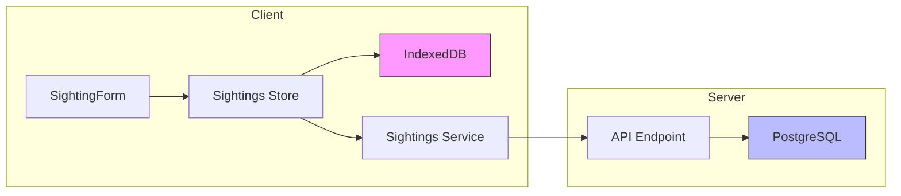

### Data Flow: Creating a Sighting

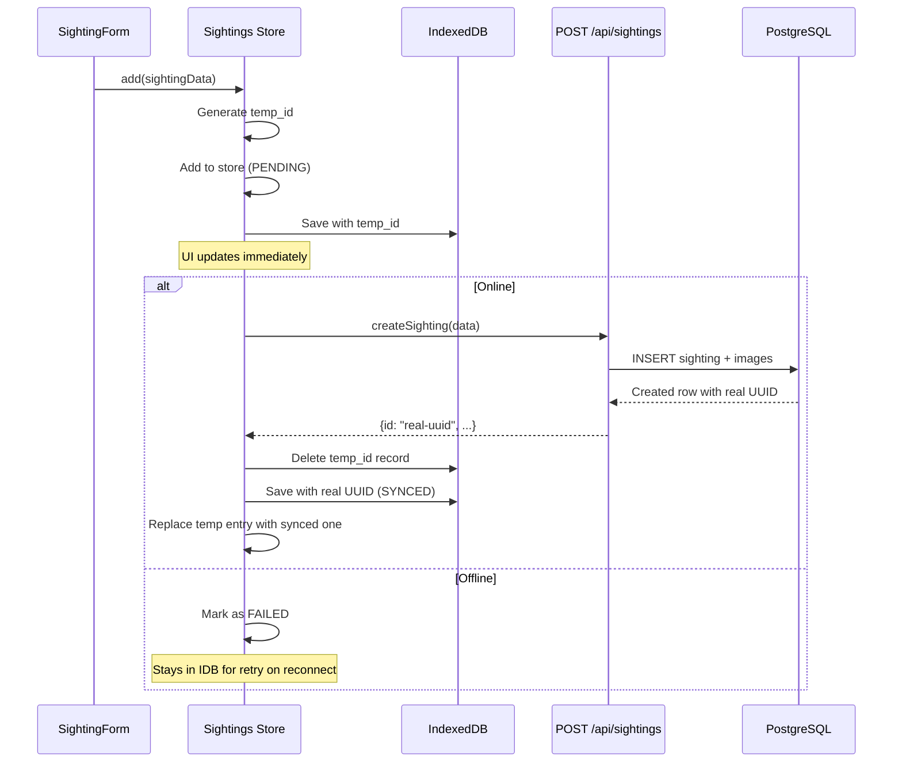

### Sync Status Lifecycle

Every sighting has a `syncStatus` that tracks where it is:

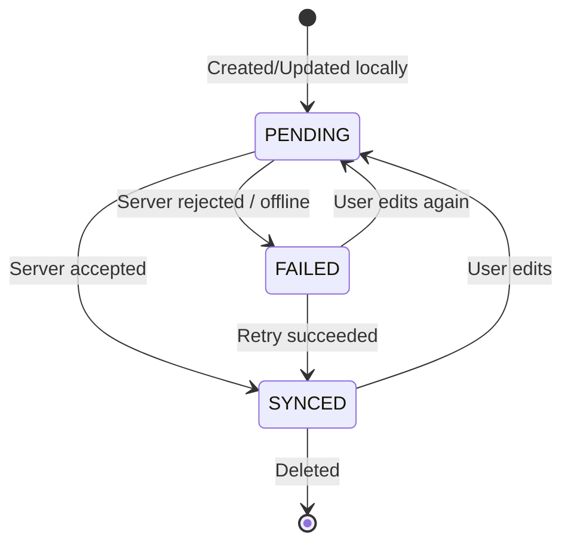

### Key Store Methods

**`init()`** — Load from IDB first, then sync:

```typescript
async init() {
    const cachedSightings = await this.loadFromIDB();
    if (cachedSightings.length > 0) {
        // Show cached data immediately
        this.store.update(s => ({ ...s, sightings: cachedSightings }));
    }
    await this.syncPendingAndReload(); // Sync with server in background
}
```

**`add(data)`** — Create a new sighting:

```typescript
async add(data) {
    // 1. Generate temporary ID
    const tempId = `temp_${Date.now()}_${Math.random().toString(36).substr(2, 9)}`;

    // 2. Save locally immediately (optimistic)
    const tempSighting = { ...data, id: tempId, syncStatus: 'PENDING' };
    this.store.update(s => ({ ...s, sightings: [...s.sightings, tempSighting] }));
    await this.upsertSightingInIDB(tempSighting);

    // 3. Try to sync with server
    try {
        const created = await this.sightingsService.createSighting(data);
        // Replace temp with real server data
    } catch {
        // Mark as FAILED — stays in IDB for retry later
    }
}
```

**`update(id, data)`** — Edit a sighting:

```typescript
async update(id, data) {
    // 1. Apply changes locally immediately
    // 2. Persist full updated sighting to IDB
    // 3. If offline → return (sync will handle it on reconnect)
    // 4. If online → PUT to server, update status to SYNCED
}
```

The update method checks `navigator.onLine` and skips the API call when offline. Changes are preserved in IDB and synced via `syncPendingAndReload` when the browser fires the `online` event.

**`remove(id)`** — Delete a sighting:

```typescript
async remove(id) {
    // 1. Remove from store + IDB immediately
    // 2. If it was a real (server) sighting, queue the delete in localStorage
    if (!id.startsWith('temp_')) {
        this.enqueuePendingDelete(id);
        await this.sightingsService.deleteSighting(id);
        this.dequeuePendingDelete(id);
    }
    // temp_ sightings just disappear — never existed on server
}
```

**`syncPendingAndReload()`** — The sync engine:

```typescript
// Runs when:
// 1. Store initializes (init())
// 2. Browser comes back online (window 'online' event, after 1s delay)
// 3. Manual load() call

async syncPendingAndReload() {
    // Guard: skip if offline
    if (navigator.onLine === false) return;

    // Step 1: Push local changes to server
    for (const sighting of unsyncedSightings) {
        if (sighting.id.startsWith('temp_')) {
            await createSighting(...)   // POST new
        } else {
            await updateSighting(...)   // PUT existing
        }
    }

    // Step 2: Process queued deletes from localStorage
    for (const id of pendingDeletes) {
        await deleteSighting(id)
    }

    // Step 3: Pull latest from server
    const serverSightings = await getSightings();

    // Step 4: Merge — server wins for synced, local wins for unsynced
    const merged = [...serverSightings(SYNCED), ...localUnsynced];

    // Step 5: Reconcile IDB with merged list
    await this.reconcileIDBWithSightings(merged);
}
```

### Payload Sanitization

The `toCreatePayload()` and `toUpdatePayload()` methods explicitly list only the fields the server accepts:

```typescript
private toUpdatePayload(sighting) {
    // Only send fields the PUT endpoint accepts
    const payload = {};
    if (sighting.species !== undefined) payload.species = sighting.species;
    if (sighting.description !== undefined) payload.description = sighting.description;
    if (sighting.latitude !== undefined) payload.latitude = sighting.latitude;
    if (sighting.longitude !== undefined) payload.longitude = sighting.longitude;
    if (sighting.images !== undefined) payload.images = sighting.images;
    return payload;
}
```

This prevents server-managed fields like `isDeleted`, `imageUrl`, `updatedAt`, or `createdAt` from leaking into API requests and causing 400 errors.

### Where Offline Data Lives

| Data                    | Storage       | Key                           |
| ----------------------- | ------------- | ----------------------------- |
| Sighting objects        | IndexedDB     | `sightings_cache` table       |
| Pending delete IDs      | localStorage  | `sightings_pending_deletes`   |
| Auth state              | localStorage  | `auth`                        |

> The store **never rolls back** local changes. If an API call fails, the sighting stays in the UI with `FAILED` status. The user's data is never lost.

---

## IndexedDB Service

`src/lib/services/idb.ts` is a generic IndexedDB wrapper used by the sightings store.

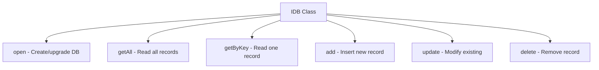

**Constructor:**

```typescript
const idb = new IDB(
    indexedDB,           // Browser's indexedDB factory
    'sightings',         // Database name
    1,                   // Version
    [{ tableName: 'sightings_cache', keyPath: 'id' }]  // Object stores
);
```

**Return type** — Every method returns:

```typescript
interface IDBOutput {
    records: unknown[];
    error: Event | string | null;
}
```

No exceptions thrown — errors come back in the `error` field.

---

## Service Worker (PWA)

The service worker lives at `src/service-worker.ts` and uses SvelteKit's `$service-worker` module for build-aware pre-caching.

### Why `src/` Instead of `static/`

A static service worker can't know the hashed filenames of SvelteKit's build output (e.g., `_app/immutable/chunks/abc123.js`). By placing it in `src/`, Vite processes it and provides:

```typescript
import { build, files, version } from '$service-worker';
// build  — array of all hashed JS/CSS chunk paths
// files  — array of all files in static/
// version — unique string per build (used as cache key)
```

### Caching Strategy

| Request Type | Strategy | Details |
|---|---|---|
| **Navigation (online)** | Network-first | Try network, cache response, fall back to cache or root shell |
| **Navigation (offline)** | Cache-first | Serve cached page, fall back to root shell `/` |
| **Immutable assets** (`/_app/immutable/`) | Cache-first, network passthrough | Serve from cache if present; if not cached (wrong build version), let network handle directly — **never** return 503 |
| **Other static assets** | Cache-first | Serve from cache, update cache on network success |
| **API requests** (`/api/*`) | Network-only | No caching; returns 503 if offline |

### Install & Activate

```typescript
// Install: pre-cache all build assets + app shell pages
sw.addEventListener('install', (event) => {
    event.waitUntil(async () => {
        const cache = await caches.open(CACHE_NAME);
        await cache.addAll([...build, ...files]); // All JS/CSS chunks
        // Cache app shell pages: /, /dashboard, /login, /signup, etc.
    });
    sw.skipWaiting(); // Activate immediately
});

// Activate: delete old caches from previous builds
sw.addEventListener('activate', (event) => {
    event.waitUntil(async () => {
        const cacheNames = await caches.keys();
        await Promise.all(
            cacheNames.filter(name => name !== CACHE_NAME).map(name => caches.delete(name))
        );
    });
    sw.clients.claim(); // Take control of all pages
});
```

### Build Version Mismatch Handling

When a new build deploys, chunk filenames change. If an old service worker is still active:

1. Old SW intercepts request for new chunk (e.g., `8.C7Nv7ZYz.js`)
2. Not in old cache → instead of returning 503, passes through to network via `fetch(event.request)`
3. User gets the new chunk from the server while the new SW installs in the background

---

## Sighting Form & Image Compression

### SightingForm Component

`src/lib/components/SightingForm.svelte` is a **reusable** form used by both the create and edit pages. It accepts an `action` prop — a function the parent provides to decide what happens on submit.

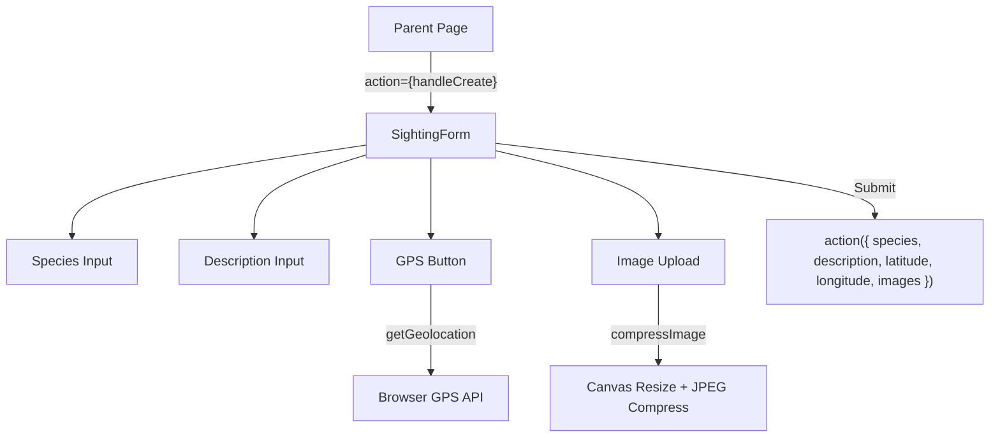

**Props (Svelte 5 runes):**

```typescript
let { id, initialValues, action }: {
    id?: string;
    initialValues?: { species, description, latitude, longitude, images };
    action: (id: string, data: CreateSightingInput) => Promise<void>
            | (data: CreateSightingInput) => Promise<void>;
} = $props();
```

**How the parent uses it (create):**

```svelte
<!-- src/routes/sighting/+page.svelte -->
<SightingForm action={handleCreate} />
```

**How the parent uses it (edit):**

```svelte
<!-- src/routes/sighting/[id]/edit/+page.svelte -->
<SightingForm
    id={sighting.id}
    initialValues={{
        species: sighting.species,
        description: sighting.description ?? '',
        latitude: sighting.latitude,
        longitude: sighting.longitude,
        images: imagesToStrings(sighting)
    }}
    action={handleUpdate}
/>
```

### Image Compression Pipeline

`src/lib/utils/image-compression.ts` compresses images client-side before sending them as base64 data URLs.

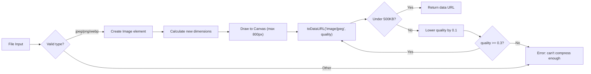

**Config** (from `constants.ts`):

```typescript
IMAGE: {
    MAX_SIZE_BYTES: 500 * 1024,   // 500KB
    MAX_DIMENSION: 800,            // pixels
    SUPPORTED_FORMATS: ['image/jpeg', 'image/png', 'image/webp'],
    INITIAL_QUALITY: 0.8,
    MIN_QUALITY: 0.3
}
```

**How images are stored:** The compressed image becomes a base64 data URL string like `data:image/jpeg;base64,/9j/4AAQ...` which is stored directly in the `images.url` column in PostgreSQL.

### Image Display Logic

Both `SightingCard` and the detail page use this priority for resolving image URLs:

```typescript
function getImageUrl(item: Sighting): string | null {
    const imageList = item.images;
    if (Array.isArray(imageList)) {
        // If images array exists, trust it exclusively
        if (imageList.length === 0) return null;  // Images were removed
        // Extract URL from first image (string or {url: string} object)
        return firstUrl;
    }
    // Fallback to imageUrl only if images array doesn't exist
    return item.imageUrl ?? null;
}
```

> When `images` is an empty array `[]`, it returns `null` — it does **not** fall back to `imageUrl`. This prevents deleted images from flashing back when the server response still has an old `imageUrl` value.

---

## Utilities

### Constants (`src/lib/utils/constants.ts`)

Central config for the entire app:

```typescript
export const API_ROUTES = {
    AUTH: { SIGNUP, LOGIN, LOGOUT, ME },
    SIGHTINGS: { BASE: '/sightings', BY_ID: '/sightings/:id', IMAGE: '/sightings/:id/image' }
};

export const BASE_PATH = '/api';

export const VALIDATION = {
    PASSWORD: { MIN_LENGTH: 8 },
    USERNAME: { MIN_LENGTH: 3, MAX_LENGTH: 20 },
    ANIMAL_NAME: { MIN_LENGTH: 1, MAX_LENGTH: 255 },
    LOCATION: { MIN_LENGTH: 1, MAX_LENGTH: 500 },
    LATITUDE: { MIN: -90, MAX: 90 },
    LONGITUDE: { MIN: -180, MAX: 180 }
};

export const PAGINATION = { DEFAULT_LIMIT: 50, MAX_LIMIT: 100 };
export const SESSION = { DURATION_DAYS: 30, COOKIE_NAME: 'auth_token' };
```

### Validation (`src/lib/utils/validation.ts`)

Two types of validators:

**1. Field validators** — Check a single value:

| Function             | What it checks                                      |
| -------------------- | --------------------------------------------------- |
| `validateEmail()`    | Regex match for email format                        |
| `validatePassword()` | Uppercase + lowercase + digit + special char + 8+   |
| `validateUsername()`  | Alphanumeric/underscore/hyphen, 3-20 chars          |
| `validateName()`     | Letters + spaces only, 2-50 chars                   |
| `validateUrl()`      | Parses with `new URL()`                             |
| `validateDate()`     | Is a valid `Date` instance                          |
| `validateLonLat()`   | Lat -90..90, Lon -180..180                          |

**2. Schema validators** — Check a full object against the Drizzle schema:

```typescript
validateObjectFromSchema(obj, schema) → { valid, errors }
validateUserObject(user)
validateSessionObject(session)
validateSightingObject(sighting)
validateImageObject(image)
```

### Timestamps (`src/lib/utils/timestamp.ts`)

```typescript
Timestamp.ensureValidDate(d)       // Date | string | null → Date (safe)
Timestamp.toISO(d)                 // → "2026-03-21T12:34:56.000Z"
Timestamp.fromISO(s)               // → Date object
Timestamp.formatForDisplay(d, tz)  // → "Mar 21, 2026, 12:34 PM"
```

### GPS (`src/lib/utils/gps.ts`)

```typescript
// Wraps navigator.geolocation.getCurrentPosition in a Promise
const { latitude, longitude } = await getGeolocation();
```

---

## Testing

### Unit Tests (Vitest)

| File                                          | What it tests                               |
| --------------------------------------------- | ------------------------------------------- |
| `src/lib/utils/validation.test.ts`            | All validators + schema validation (34 tests) |
| `src/lib/utils/timestamp.test.ts`             | Date parsing, formatting, edge cases        |
| `src/lib/services/idb.test.ts`                | IndexedDB CRUD operations                   |
| `src/lib/services/service-worker.test.ts`     | Service worker cache logic                  |
| `src/lib/stores/sightings.test.ts`            | Offline sync, add/update/remove, merge (11 tests) |
| `src/routes/api/sightings/server.test.ts`     | GET list + POST create (15 tests)           |
| `src/routes/api/sightings/[id]/server.test.ts` | GET by ID, auth, ownership (6 tests)       |
| `src/routes/api/sightings/[id]/server-put.test.ts` | PUT image handling (4 tests)           |
| `src/routes/api/sightings/[id]/image/server.test.ts` | Image GET/POST/DELETE (8 tests)      |

### E2E Tests (Playwright)

| File                          | What it tests                                       |
| ----------------------------- | --------------------------------------------------- |
| `e2e/auth-sightings.spec.ts` | Signup → login → create → edit → delete (serial)    |
| `e2e/offline.spec.ts`        | SW cache, IDB persistence, offline delete + sync    |

### Mocking Pattern

API tests mock the database to avoid needing PostgreSQL:

```typescript
const limitMock = vi.fn();
const whereMock = vi.fn(() => ({ limit: limitMock }));
const fromMock = vi.fn(() => ({ where: whereMock }));
const selectMock = vi.fn(() => ({ from: fromMock }));

vi.mock('$lib/db/client', () => ({
    db: { select: selectMock }
}));

// Then control "database" returns:
limitMock.mockResolvedValueOnce([{ id: 'sighting-1', ... }]);
```

### Running Tests

```bash
npm test              # Run all unit tests (Vitest)
npx vitest            # Watch mode
npx playwright test   # Run E2E tests
```

---

## Deployment

### CI Pipeline (GitHub Actions)

The CI workflow (`.github/workflows/ci.yml`) runs on push/PR to `main`:

```
Install → Unit Tests → TypeScript Check → Build → Playwright Install → Push DB Schema → E2E Tests
```

Uses a PostgreSQL 16 service container with `E2E_SKIP_DOCKER=1` (tests use CI's Postgres instead of Docker).

### Render (Cloud)

Uses `adapter-auto` (default). No special configuration needed — Render detects SvelteKit automatically.

### Proxmox (Self-Hosted)

The Proxmox deployment (`.github/workflows/deploy-proxmox.yml`) triggers on **every push** and runs on a **self-hosted GitHub Actions runner**:

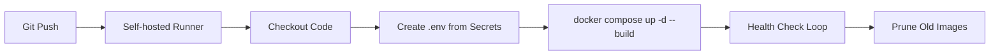

**Docker Stack** (`docker-compose.prod.yml`):

| Service | Image | Port | Purpose |
|---------|-------|------|---------|
| `app`   | Custom (Dockerfile) | 3000 | SvelteKit Node server |
| `db`    | postgres:16 | Internal | PostgreSQL with persistent volume |

**Dockerfile** — Multi-stage build:

```
Stage 1 (builder): node:22-alpine → npm ci → ADAPTER=node npm run build
Stage 2 (production): Copy build output, schema files, entrypoint → port 3000
```

**Startup** (`docker-entrypoint.sh`):

```bash
# Push DB schema (idempotent — safe every time)
npx drizzle-kit push --config ./drizzle.config.ts --force
# Start the Node server
exec node build
```

**External Access:** Use Cloudflare Tunnels pointing to `localhost:3000` on the Proxmox host.

---

## Full Request Lifecycle

Putting it all together — what happens when a user creates a sighting:

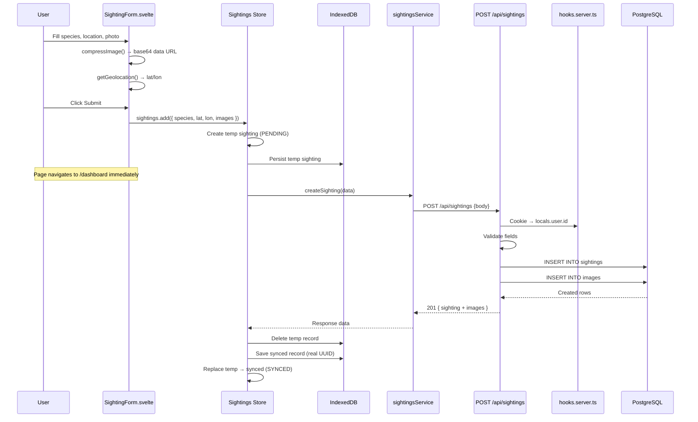
